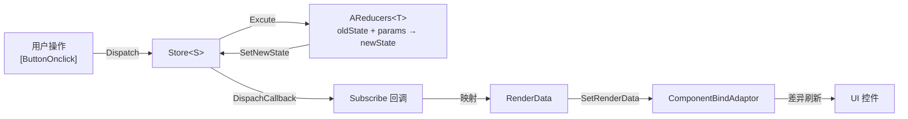

# UFlux Overview

## The problem it solves

The typical Unity UI approach is `MonoBehaviour` + `Update()` polling + mutating controls directly. At scale, three classes of problems appear:

| Problem | Symptom |
|---------|---------|
| Rendering coupled to business logic | Screen code mixes protocol parsing, table lookups and network requests |
| Uncontrollable refresh timing | Field changes are polled from `Update()`, destroying both performance and readability |
| Hard to reuse | A panel's logic and node paths are hardcoded, so no reusable unit can be extracted |

UFlux answers with **layering**: business state belongs to State, render data belongs to RenderData, and the screen is only responsible for "putting data onto nodes".

## Layer responsibilities

| Layer | Types | Responsibility | Must not do |
|-------|-------|----------------|-------------|
| **View** | `AWindow<TP>` / `ATComponent<T>` | Hold node references, respond to input, place RenderData onto the UI | No table lookups, no protocol sends, no state transitions |
| **RenderData (Props)** | `ARenderDataBase` | Describe "what the screen should look like right now" | Hold no business logic |
| **State** | `AStateBase` + `AReducers<T>` + `Store<S>` | Business state and state transitions | Touch no UI nodes |

## Data flow

The last two steps are the crux: **only fields that actually changed are written to the UI**. The diff analysis is done by `ComponentBindAdaptorManager.AnalysisRenderDataChanged`.

## Mapping to Redux

| Redux | UFlux | Difference |
|-------|-------|------------|
| `Store` | `Store<S>` | Same |
| `Reducer` | `AReducers<T>` | Same, plus synchronous/asynchronous/callback execution modes |
| `dispatch(action)` | `Store.Dispatch(Enum actionEnum, object @params)` | Uses an `Enum` as the action identity (safer than strings) |
| `subscribe(listener)` | `Store.Subscribe(Action<S>)` / `Subscribe(Enum tag, …)` | Supports **subscribing by action tag** |
| Middleware | None | Not implemented |
| `combineReducers` | `StoreFactory.CreateStore<A,B,…>` + `StoreWrapper` | Supports combining 2–5 stores |
| Time-travel debugging | `stateCacheQueue` (capped at 20) | **`UnDo()` / `CancelUnDo()` are empty stubs** |

!!! warning "Store history rollback is not implemented yet"
    `Store<S>` maintains a `stateCacheQueue` internally (caching 20 old States by default), but `UnDo()` and `CancelUnDo()` have **empty bodies**. The cache is merely reserved.

## Mapping to MVC

| MVC | UFlux |
|-----|-------|
| Model | A class derived from `AStateBase` (business state) |
| View | `AWindow<TP>` / `ATComponent<T>` |
| Controller | `AReducers<T>` (purely `oldState + params → newState`, stateless) |
| — | **An extra RenderData layer**: maps the Model into "data the screen can render", consumed by `AComponentBindAdaptor` |

That extra layer is UFlux's central trade-off: it turns "what the screen should look like" into **pure, individually testable data**, at the cost of writing one RenderData class per screen.

## When you do not need RenderData

Not every window needs all three layers. Choose by complexity:

| Scenario | Recommended approach |
|----------|---------------------|
| A few buttons, no dynamic data | `AWindow` + `[TransformPath]` + `[ButtonOnclick]`, **no** RenderData |
| Dynamic text/images that need refreshing | `AWindow<TP>` + `ComponentValueBind` |
| Lists with add/remove/modify | `AWindow<TP>` + `PropsList<T>` |
| State shared across windows | `Store<S>` + `AReducers<T>` |

!!! tip "Do not fetishise decoupling"
    The framework author states this explicitly in the original documentation: **sensible screen decomposition matters more than blindly applying MVC**. Force-splitting a 20-line popup into Window + State + Reducer + RenderData across four files actually makes it *less* maintainable.

## Key type reference

| Type | Namespace | Purpose |
|------|-----------|---------|
| `UIManager` | `BDFramework.UFlux` | The main window entry point (`ManagerBase<UIManager, UIAttribute>`) |
| `UILayer` | `BDFramework.UFlux` | `Bottom` / `Center` / `Top` |
| `IWindow` / `AWindow` / `AWindow<TP>` | `BDFramework.UFlux` | Windows |
| `IComponent` / `ATComponent<T>` / `AComponent` | `BDFramework.UFlux` | Components |
| `ARenderDataBase` | `BDFramework.UFlux` | Render data base class |
| `AStateBase` / `StateBase` | `BDFramework.UFlux` | State base classes |
| `AReducers<T>` | `BDFramework.UFlux.Reducer` | Reducer base class |
| `Store<S>` / `IStore` / `StoreFactory` / `StoreWrapper` | `BDFramework.UFlux.Contains` | Redux-style Store |
| `UFluxAction` | `BDFramework.UFlux.Reducer` | Action carrier |
| `PropsList<T>` | `BDFramework.UFlux.Collections` | Diffing list |
| `AComponentBindAdaptor` | `BDFramework.UFlux` | Value-binding adapter base class |
| `ComponentBindAdaptorManager` | `BDFramework.UFlux` | Adapter registration and diff refresh |

!!! note "`Store<S>` lives in `BDFramework.UFlux.Contains`"
    Not `BDFramework.UFlux`. `StoreFactory`, `IStore`, `StoreWrapper` and `SubscribeAttribute` are in that namespace too. It is easy to forget the `using`.

## Related pages

- [Window](window.md) — the full lifecycle from creation to destruction
- [State Management (Reducer/Store)](state-management.md) — detailed API
- [RenderData](render-data.md) — value binding and diff refresh
- [Demo Walkthrough](../tutorials/demos.md) — runnable examples
