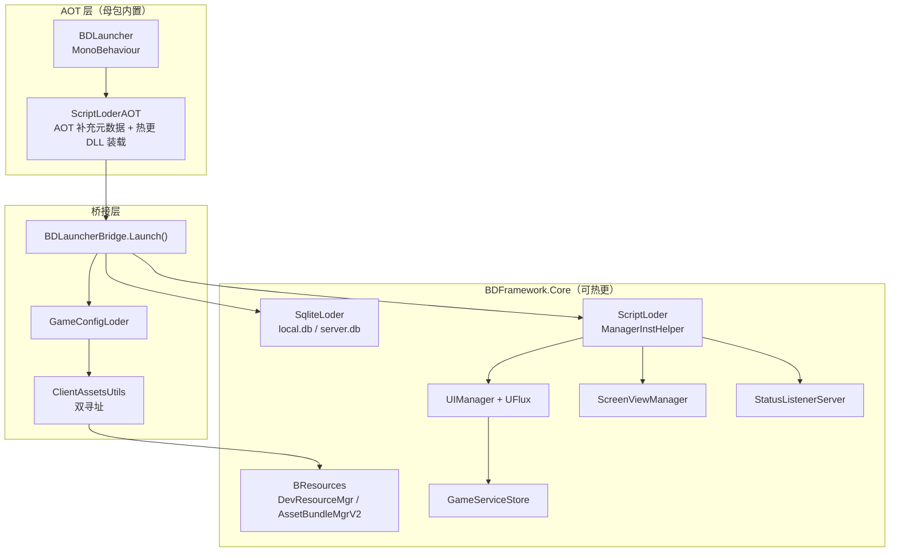

# BDFramework 文档

BDFramework 是一套面向 **Unity 手游长线运营**的工程框架，覆盖三条主线：

| 主线 | 解决的问题 | 主要入口 |
|------|-----------|---------|
| **热更与资源** | 代码/表格/美术资源不发版更新 | `ScriptLoder`、`SqliteLoder`、`BResources` |
| **UI 架构（UFlux）** | 复杂界面的渲染、状态与解耦 | `UIManager`、`AWindow<T>`、`Reducer/Store` |
| **构建发布管线** | 资源打包、母包构建、CI 制品的可重复性 | `BuildTools_*`、`PublishPipeLineCI` |

当前文档对应分支 `v4/v-4.0.0`（Unity 2021，包版本 `com.popo.bdframework@4.0.0`，热更方案为 **HybridCLR**）。

!!! info "文档分层"
    本站是**面向人的发布文档**。面向 Agent 的规则（编码流程、质量门禁、文件级约束）维护在 `.github/` 下，两者关系见 [文档治理](agent/doc-governance.md)。

## 从哪里开始

- :material-rocket-launch: **刚接触框架**

    ---

    从安装、目录约定和资源寻址规则读起，建立工程结构的正确心智模型。

    [:octicons-arrow-right-24: 快速开始](guide/installation.md)

- :material-sitemap: **想知道代码怎么组织**

    ---

    程序集划分、启动链路、Runtime 与 Editor 模块地图，以及待重构问题清单。

    [:octicons-arrow-right-24: 架构](architecture/index.md)

- :material-window-restore: **要写 UI**

    ---

    UFlux 的三层结构：Window / Component / State，以及绑定、消息、依赖注入。

    [:octicons-arrow-right-24: UI（UFlux）](ui/index.md)

- :material-package-variant-closed: **要出包 / 接 CI**

    ---

    热更 DLL、AssetBundle、表格、母包四条构建链路与发布上传协议。

    [:octicons-arrow-right-24: 构建与发布](pipeline/index.md)

- :material-robot: **让 AI 帮你改框架代码**

    ---

    按模块拆分的 Skill 集，让 Agent 直接掌握各模块的 API 与陷阱。

    [:octicons-arrow-right-24: Skill 索引](agent/skills.md)

## 框架全貌

## 三条最容易踩错的规则

1. **热更代码的边界**：主工程（`Assembly-CSharp-firstpass` 之外的 AOT 代码）**不能直接引用热更类型**，只能通过 `StatusListenerServer` / 管理器属性这类解耦通道通信。详见[资源加载寻址](guide/asset-load-path.md)与[热更代码构建](pipeline/build-hotfix-dll.md)。
2. **可显式加载的资源必须放在 `Runtime` 目录下**：`Assets/*/Runtime/**` 是框架收集资源的唯一约定入口，放错位置会在打包时被静默忽略。详见[目录结构与约定](guide/project-structure.md)。
3. **Editor 与真机的路径不同**：Editor 下 `streamingAssetsPath` 被重写为 `DevOps/PublishAssets`，`persistentDataPath` 被重写为 `<ProjectRoot>/.AppData`。写路径相关代码前先看[资源加载寻址](guide/asset-load-path.md)。

## 文档结构

| 分区 | 内容 |
|------|------|
| [快速开始](guide/installation.md) | 安装、目录约定、资源寻址、编码规范 |
| [架构](architecture/index.md) | 程序集、启动链路、模块地图、重构清单 |
| [UI（UFlux）](ui/index.md) | Window / Component / RenderData / State / Store / DI |
| [Runtime API](api/index.md) | 管理器、资源、表格、事件、配置、导航、工具 |
| [构建与发布](pipeline/index.md) | 热更 DLL、AssetBundle、表格、母包、发布、CI |
| [Editor](editor/index.md) | Editor 核心类、Http 服务、管线钩子、菜单索引 |
| [测试](testing/index.md) | 单元测试、BatchMode 测试、E2E |
| [教程与 Demo](tutorials/index.md) | 业务 Demo 解读与外部视频资源 |
| [Agent](agent/index.md) | Skill 体系与文档治理规则 |
| [归档](archive/index.md) | 从 Wolai 迁移前的原始导出与迁移对照 |
