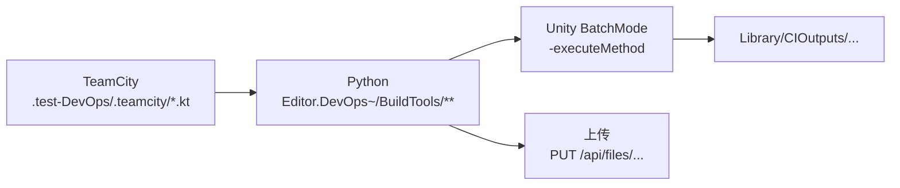

# DevOps 与 CI

CI 由 **TeamCity 调度 Python 脚本**，Python 拼装 Unity BatchMode 命令并上传制品。



## BatchMode `-executeMethod` 入口

全部位于 `BDFramework.Editor.DevOps.PublishPipeLineCI`
（`Packages/com.popo.bdframework/Editor/EditorPipeline/DevOpsPipeline/CI/PublishPipeLineCI.cs`）。

| `-executeMethod` | `[CI]` 说明 | 转发到 |
|------------------|------------|--------|
| `…PublishPipeLineCI.CheckEditorCode` | 代码检查 | `BuildTools_HotfixScript.CheckEditorCode()` |
| `…PublishPipeLineCI.BuildDLL` | — | **空实现** |
| `…PublishPipeLineCI.BuildTable` | BatchMode构建统一表格 | `BuildTools_Excel2SQLite.BuildTableForBatchMode()` |
| `…PublishPipeLineCI.BuildCode{Android,IOS,Windows}` | BatchMode构建热更代码* | `BuildTools_Assets.BuildClientResForBatchMode(bt, BuildPackageOption.BuildHotfixCode)` |
| `…PublishPipeLineCI.BuildAssetbundle{Android,IOS,Windows}` | BatchMode构建热更Assetbundle * | `BuildClientResForBatchMode(bt, BuildPackageOption.BuildArtAssets)` |
| `…PublishPipeLineCI.VerifyClientRes{Android,IOS,Windows}` | BatchMode验证热更资源 * | `AssetsVersionController.VerifyFileServerAssetsForBatchModeWithRequest` |
| `…PublishPipeLineCI.BuildClientPackage{Android,IOS,Windows}` | BatchMode构建母包*-Release | 私有 `BuildClientPackageForBatchMode(BuildTarget)`（**完整注入版**） |
| `…PublishPipeLineCI.PublishPackage_{Android,iOS,Windows}{Debug,Release,DebugForProfiler,ReleaseForTest}` | 发布母包* | 直接调 `BuildTools_ClientPackage.BuildClientPackageForBatchMode`（**不注入测试程序集**） |

!!! danger "两组母包入口行为不同"
    - `PublishPackage_*`（12 个）：直接调 `BuildClientPackageForBatchMode`，**绕过**测试程序集注入与 `TalosDebugDefineScope`
    - `BuildClientPackage{Android,IOS,Windows}`（3 个）：走完整注入版

    选错会导致 Debug 包里没有测试程序集，或 Release 包里混入测试程序集。

!!! note "Android 验证入口会先准备环境"
    `VerifyClientResAndroid` 先调 `AndroidExternalToolsBatchResolver.EnsureAndroidExternalToolsForBatchMode()`。

辅助公开 API：

```csharp
static public bool IsDebugBuildRequested();
static public bool IsDebugBuildRequested(IReadOnlyList<string> args);
static public BuildTools_ClientPackage.BuildMode ResolveClientPackageBuildModeForBatchMode([args]);
static public bool ShouldIncludeDebugSymbolForTalosClientPackageBuild(BuildMode mode);
public static AssetsVersionController.FileServerBatchVerificationRequest
    CreateVerifyClientResRequestForBatchMode(BuildTarget, IReadOnlyList<string> args, bool resetLocalStateBeforeVerify = true);
```

静态构造：`if (Application.isBatchMode) BDFrameworkEditorEnvironment.InitEditorEnvironment();`

## CI 命令行参数（C# 侧解析）

| 参数 | 解析点 |
|------|--------|
| `-clientVersion` | `BuildTools_ClientPackage.ClientVersionBatchArgName` |
| `-buildDebug true\|false` | `BuildTools_ClientPackage` / `PublishPipeLineCI` |
| `-buildMode Debug\|DebugForProfiler\|Release\|ReleaseForTest` | `ResolveClientPackageBuildModeForBatchMode` |
| `-ciOutputRoot <path>` | `BuildTools_Assets.CIOutputRootBatchArgName` |
| `-fileServerUrl` | `AssetsVersionController.FileServerUrlBatchArgName` |
| `-expectedCodeVersion` / `-expectedAssetbundleVersion` / `-expectedTableVersion` | 同名 const |
| `-buildTarget` | **Python 侧读取用于拼命令；C# 侧不解析** |
| `-talosForceE2E` | `TalosE2EBatchBridge` |

## 标准 Unity 命令行

```bash
<Unity> -batchmode \
        -projectPath <project_dir> \
        -executeMethod <cls.method> \
        -clientVersion <ver> \
        -logFile <log> \
        [-buildDebug <bool>] \
        [-buildTarget Android|iOS|Win64] \
        [-ciOutputRoot <dir>] \
        -quit
```

规则：

| 规则 | 说明 |
|------|------|
| 额外参数插到 **`-quit` 之前** | Python `insert_command_argument`；`-quit` 缺失时追加到末尾 |
| `-buildTarget` 映射 | `android→Android`、`ios→iOS`、`windows→Win64` |
| **ClientRes 类任务必须显式传 `-buildTarget`** | 否则用当前 Editor 平台 |
| Table 任务只传 `-ciOutputRoot` | 上传平台由宿主映射 `TABLE_OUTPUT_PLATFORM_BY_HOST = {mac: osx, windows: windows, linux: linux}` |
| Verify 任务传 `-buildTarget` + `-fileServerUrl`（含 `/files`）+ 三段 `-expected*Version` | |
| **不使用 `-nographics`** | |
| **禁止在 Editor 内切换 ClientRes 目标平台** | 通过 `-buildTarget` 指定 |

!!! danger "`-quit` 是必需的"
    本机 Unity 2021.3.58f1 在 batchmode 主循环会因 License 签名校验崩溃（`CheckLicenseActivated()` segfault）。`-quit` 让 Unity 在进入主循环前退出。

    `-force-open` 在本机会 Bus Error，**禁用**。

## Python 脚本与 CLI

位于 `Packages/com.popo.bdframework/Editor.DevOps~/BuildTools/`（`~` 后缀 = Unity 忽略该目录）。

| 脚本 | `-executeMethod` | 必选参数 | 可选参数 |
|------|-----------------|---------|---------|
| `BuildClientResAssetbundle/build_{android,ios,windows}.py` | `BuildAssetbundle*` | `--client-version` | `--build-name` `--build-number` `--unity-version` `--project-dir` `--debug-build` `--phase all\|build\|upload` `--dry-run` |
| `BuildClientResCode/build_{android,ios,windows}.py` | `BuildCode*` | `--client-version` | 同上 |
| `BuildClientResTable/build_table.py` | `BuildTable` | （`--client-version` 可选） | 同上（无 `--debug-build`） |
| `BuildClientPackage/build_{android,ios,windows}.py` | `BuildClientPackage*` | `--client-version` | `--build-name` `--build-number` `--unity-version` `--project-dir` `--debug-build` `--build-mode` `--file-server-url` `--dry-run` |
| `VerifyClientRes/verify_{android,ios,windows}.py` | `VerifyClientRes*` | `--client-version` `--expected-*` `--server-url` `--config` | … |
| `VerifyClientRes/test_client_res.py` | （纯 TeamCity 调度） | — | 子命令 `resolve-builds` / `wait-builds` / `queue-verify-build` |

### 公共 helper

| 文件 | 关键 API |
|------|---------|
| `Common/artifact_uploader.py` | `resolve_file_server_settings`、`upload_single_file`、`upload_to_remote_root`、`upload_client_package`、`build_artifact_remote_root`、`ArtifactType`、`compute_file_sha256` |
| `Common/client_resource_artifacts.py` | `get_ci_output_root`、`prepare_clean_ci_output_root`、`prepare_{code,assetbundle,table}_upload_source`、`upload_client_res_*`、`validate_uploaded_artifacts` |
| `Common/client_resource_flow.py` | `run_platform_resource_build`、`run_table_resource_build`、`run_platform_resource_verify`、`parse_*_args`、`prepare_platform_ci_project_dir` |
| `Common/client_resource_version_manifest.py` | `clientRes_{platform}/version.info` = `code.assetbundle.table` |
| `Common/buildtools_config.py` | typed dataclass 配置入口（**唯一 TOML 读取点**） |
| `Common/buildtools_config_guard.py` | 拦截 ad hoc TOML 解析 |

## 本地隔离输出

```text
<projectDir>/Library/CIOutputs/<build_kind>/<build_name>/<build_number>[/<platform>]
```

`build_kind` ∈ `clientres_code` / `clientres_assetbundle` / `clientres_table`；日志在 `Library/CIOutputs/logs`。

| 阶段 | 行为 |
|------|------|
| `build` | 先清空（`prepare_clean_ci_output_root`） |
| `upload` | **不清空** |

## TeamCity Kotlin DSL

!!! note "DSL 位置不在 `DevOps/` 下"
    位于 **`.test-DevOps/.teamcity/`**。

| 文件 | BuildType / Project |
|------|-------------------|
| `Project.kt` | `BDFrameworkCoreProject` = `BDFramework.Core`；subProject：ClientPackage / ClientResCode / ClientResAssetbundle / ClientResTable / TalosAI / TestPipeline |
| `projects/ClientPackage.kt` | `ClientPackage` |
| `projects/ClientResCode.kt` / `ClientResAssetbundle.kt` / `ClientResTable.kt` | `ClientRes_Code` / `ClientRes_Assetbundle` / `ClientRes_Table` |
| `projects/TestPipeline.kt` + `ClientResVerify.kt` | `TestPipeline/TestBuildPipeline_ClientRes` |
| `projects/TalosAI.kt` + `TalosAIE2E.kt` | `TalosAI/TalosAI.E2E` |
| `buildTypes/BuildClientPackage.kt` + `_android/_ios/_windows.kt` | 聚合 + 三端母包 |
| `buildTypes/BuildCode_{android,ios,windows}.kt` | `BDFrameworkCore_BuildCode*` |
| `buildTypes/BuildAssetbundle_{android,ios,windows}.kt` | `BDFrameworkCore_BuildAssetbundle*` |
| `buildTypes/BuildTable.kt` | `BDFrameworkCore_BuildTable` |
| `buildTypes/TestClientRes.kt` | `BDFrameworkCore_TestClientRes`（3 step：resolve-builds / wait-builds / queue-verify-build） |
| `buildTypes/TalosAI*.kt` | E2E 任务 |
| `vcsRoots/Github.kt` | `【Github】BDFramework.core` |

通用参数：`build.client.version`（默认 `0.1`）、`build.extra.args`、`ci.python.command`（默认 `python`）、`build.debugBuild`。

典型 step：

```kotlin
scriptContent = """
    %ci.python.command% "Packages/com.popo.bdframework/Editor.DevOps~/BuildTools/BuildClientResAssetbundle/build_android.py" \
      --client-version "%build.client.version%" \
      --build-name "BuildAssetbundle_android" \
      --build-number "%build.number%" \
      --project-dir "%teamcity.build.checkoutDir%" \
      --phase build %build.extra.args%
""".trimIndent()
```

`artifactRules = "Library/CIOutputs/logs => build-logs"`。

## 外部配置

| 文件 | 内容 |
|------|------|
| `Packages/com.popo.bdframework/Editor.DevOps~/BuildTools/buildtools.toml` | `[artifact_file_server]`、`[ci_server]`、`[ios_xcode]`、`[tests.remote_artifact]` |
| `DevOps/CI/buildtools.toml` | **内容重复的副本**（见[重构清单](../architecture/refactor-backlog.md#ref-20-duplicated-config)） |
| `DevOps/CI/talos_e2e_config.toml` | `[talos.e2e]` client_version / build_debug / build_mode / timeout / unity_host / unity_port |
| `DevOps/Config/BDFrameworkSetting.conf` | 编辑器设置（keystore 路径等） |
| `DevOps/Config/HotfixFile.conf` | 热更文件过滤规则 |

**配置优先级**（`resolve_file_server_settings`）：

```text
显式参数 > 环境变量 ARTIFACT_FILE_SERVER_URL
        > buildtools.toml[artifact_file_server].base_url
        > ARTIFACT_FILE_SERVER_IP / ip
        > 127.0.0.1:20001
```

**配置路径优先级**：

```text
config_path / --config > BUILDTOOLS_CONFIG > 旧模块级环境变量 > buildtools.toml > buildtools.toml.example
```

## pytest 覆盖

```bash
python -m pytest Packages/com.popo.bdframework/Editor.DevOps~/BuildTools/tests/ [-q] [--run-remote-artifact-tests]
```

| 测试文件 | 覆盖 |
|---------|------|
| `conftest.py` | `--run-remote-artifact-tests` 开关 + `remote_artifact` marker |
| `test_buildclientpackage_helpers.py` | 打包产物生成 / ZIP 条目 |
| `test_buildclientpackage_batchmode.py` | 命名路径、project dir 校验、Unity 可执行解析 |
| `test_buildclientpackage_main_flow.py` | 主流程（fake flow） |
| `test_buildtools_config.py` | external integration config 读取 |
| `test_artifact_uploader.py` | 本地上传 HTTP server（成功/错误/恢复） |
| `test_artifact_uploader_remote.py` | 远端 smoke（需 marker） |
| `test_client_resource_artifacts.py` | 输出根清理、staging、manifest 校验 |
| `test_client_resource_flow.py` | 三端 wrapper 委派、flow 步骤、dry-run |
| `test_client_resource_verify.py` | 验证 wrapper |
| `test_client_resource_version_manifest.py` | `version.info` 解析/校验 |
| `test_test_client_res.py` | TeamCity build 复用/等待逻辑 |

## Unity 侧纯逻辑验证入口

```bash
"$UNITY_PATH" -batchmode -quit \
  -projectPath "/Users/naipaopao/Documents/GitHub/BDFramework.Core" \
  -executeMethod BDFramework.EditorTest.DevOps.PublishPipeLineCITest.RunBatchVerification \
  -logFile /tmp/PublishPipeLineCITest.log

"$UNITY_PATH" -batchmode -quit \
  -projectPath "/Users/naipaopao/Documents/GitHub/BDFramework.Core" \
  -executeMethod BDFramework.EditorTest.AssetsManager.AssetsVersionControllerDevOpsBatchVerification.RunBatchVerification \
  -logFile /tmp/AssetsVersionControllerDevOpsBatchVerification.log
```

## 平台隔离与缓存

!!! warning "只有 Assetbundle 强制平台隔离 checkout"
    - TeamCity `checkoutDir = ClientRes/{platform}`
    - `prepare_platform_ci_project_dir` 优先复现 `already_isolated`（父目录名 == platform），否则 `git worktree add --force --detach` 到 `../<platform>/<repo-name>`
    - **Code / Table / Verify 不做隔离**（`ciProjectIsolation=skipped`）

原因：AB 打包依赖平台相关的 `Library/` 缓存，跨平台复用会污染 SBP 缓存。

其他缓存约束：

| 项 | 说明 |
|----|------|
| iOS BatchMode SBP 首败重试 | 重导纹理 + 清 `Temp/ContentBuildData`；**仅当工程不是平台隔离目录时**才额外 `BuildCache.PurgeCache(false)` |
| SBP 本地 BuildCache | `PruneCache_Background(200GB)` |
| 黑名单剔除 | `buildlogtep.json` / `build_result.info` / `EditorBuild.Info` / `package_build.info` 不上云 |

## 给 CI 的建议（来自框架作者）

1. 提交即构建 DLL 并跑测试 —— 尽早暴露热更代码的编译问题
2. 资源提交构建双端（Android + iOS）—— 双端打包差异是最常见的线上问题源
3. 定期构建 ipa/apk —— 验证完整出包链路
4. 装虚拟机跑自动化 —— 真机验证不可或缺
5. 定期做 UWA 性能采样 —— 长线项目性能腐化是渐进的

## 已知漂移

| 项 | 事实 |
|----|------|
| `DevOps/CI/githook/` | **未找到**；`DevOpsEditorTasks.UpdateGitHookToLocalStore` 仍引用该路径 |
| `DevOps/PublishPackages/` | 空目录 |
| `DevOps/CI/buildtools.toml` | 与包内那份重复 |
| `PublishPipeLineCI.BuildDLL()` | 空实现 |
| `PublishPipelineTools` 注释 | 与实现的路径顺序相反 |

## 相关页面

- [管线回调钩子](../editor/publish-hooks.md)
- [资源发布](publish-assets.md) —— 上传协议与验证
- [BatchMode 与 CI 测试](../testing/batchmode-tests.md)
- [E2E（Talos）](../testing/e2e.md)
