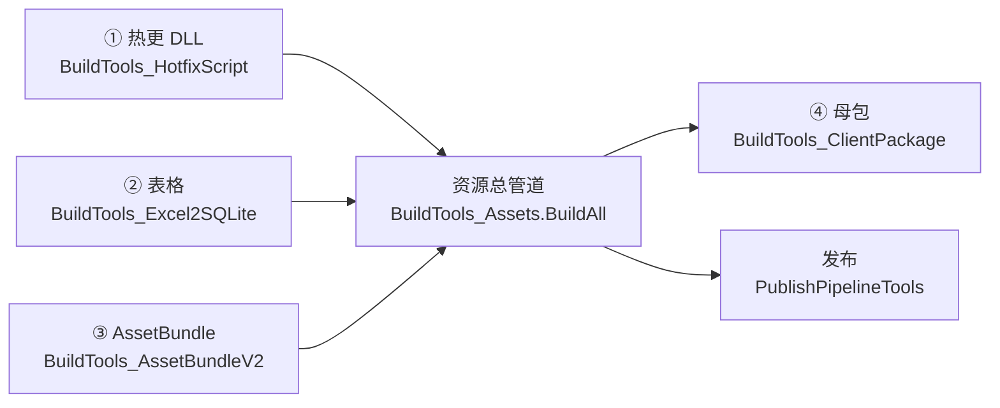

# 构建与发布

BDFramework 有**四条独立构建链路** + **一条资源总管道**把它们串起来。



## 四条链路

| # | 链路 | 入口类 | 入口方法 | 产物 |
|---|------|--------|---------|------|
| ① | [热更代码](build-hotfix-dll.md) | `BDFramework.Editor.HotfixScript.BuildTools_HotfixScript` | `BuildDLL(string outpath, RuntimePlatform platform)` | `<out>/<platform>/script/hotfix/*.zlua.bytes`<br/>`<out>/<platform>/script/aot_patch/*.zlua.bytes` |
| ② | [表格](build-table.md) | `BDFramework.Editor.Table.BuildTools_Excel2SQLite` | `BuildSqlite(string ouptputPath, RuntimePlatform platform, DBType dbType, bool isUseCache)` | `<out>/<platform>/local.db`<br/>`<out>/server_data/server.db` |
| ③ | [AssetBundle](build-assetbundle.md) | `BDFramework.Editor.BuildPipeline.AssetBundle.BuildTools_AssetBundleV2` | `BuildAssetBundles(RuntimePlatform platform, string outputPath)` | `<out>/<platform>/art_assets/` |
| ④ | [母包](build-package.md) | `BDFramework.Editor.BuildPipeline.BuildTools_ClientPackage` | `Build(BuildMode, string buildScene, string buildConfig, bool isGenAssets, string outdir, BuildTarget, …)` | `DevOps/PublishPackages/<platform>/…` |

## 资源总管道

```csharp
BuildTools_Assets.BuildAll(platform, outputPath, clientVersion, buildOption)
```

| 步骤 | 内容 |
|------|------|
| 0 | `OnBeginBuildAllAssets` → 取版本号 |
| 1 | 热更 DLL |
| 2 | SQLite |
| 3 | AssetBundle |
| 4 | `GenBasePackageBuildInfo(bundleVersion)` |
| 5 | **`assets.info` 生成** ← 源码注释强制要求放最后 |
| 6 | `OnEndBuildAllAssets` |

`BuildPackageOption` 可指定只跑其中一部分（`BuildHotfixCode` / `BuildArtAssets` / `BuildAll`），CI 正是靠它拆分任务。

## 产物目录布局

```text
DevOps/PublishAssets/                     ← 构建根（Editor 下 streamingAssetsPath 被重写到这里）
├── <platform>/
│   ├── art_assets/
│   │   ├── <ABName 或 GUID>              AB 本体（无扩展名）
│   │   ├── art_assets.info               加载索引（CSV: List<AssetBundleItem>）
│   │   ├── art_asset_type.info           资源类型表（CSV）
│   │   └── EditorBuild.Info              构建信息（仅 Editor，发布时剔除）
│   ├── script/
│   │   ├── hotfix/<asm>.zlua.bytes       热更 DLL
│   │   └── aot_patch/<asm>.zlua.bytes    AOT 补充元数据
│   ├── local.db                          客户端表（SqlCipher 加密）
│   ├── assets.info                       资源清单（CSV: List<AssetItem>）
│   ├── assets_subpack.info               分包配置
│   ├── package_build.info                母包构建信息（含三段 SVC 版本号）
│   ├── server_assets_version.info        版本信息（JSON）
│   └── build_result.info / buildlogtep.json   SBP 构建日志（发布时剔除）
├── server_data/server.db                 服务器表（不加密）
└── _ReadyToUpload/<version>/<platform>/  待上传目录（发布管线产出）
```

平台目录名（`BApplication.GetPlatformLoadPath`）：`windows` / `android` / `osx` / `ios`。

## 构建菜单入口

| 菜单路径 | 排序 | 作用 |
|---------|------|------|
| `BDFrameWork工具箱/Odin BuildPipeline` | — | 构建总窗口（`EditorWindow_BuildPipeline`） |
| `BDFrameWork工具箱/1.DLL打包` | 52 | 脚本打包面板 |
| `BDFrameWork工具箱/2.AssetBundle打包` | 53 | 资源打包面板 |
| `BDFrameWork工具箱/3.表格/表格->生成SQLite` | 55 | Excel → local.db |
| `BDFrameWork工具箱/3.表格/表格->生成SQLite[Server]` | 56 | Excel → server.db |
| `BDFrameWork工具箱/3.表格/表格->生成Class[程序目录]` | 54 | Excel → C# 表类 |
| `BDFrameWork工具箱/3.表格/表格预览` | 54 | 表格预览窗口 |
| `BDFrameWork工具箱/4.网络协议/Protobuf->生成Class` | 57 | Protobuf 生成 |
| `BDFrameWork工具箱/5.构建包体` | 58 | 母包构建面板 |
| `BDFrameWork工具箱/PublishPipeline/1.发布资源` | 101 | 发布资源窗口 |
| `BDFrameWork工具箱/HotfixPipeline/1.配置热更文件` | 111 | 热更文件配置 |
| `BDFrameWork工具箱/DevOps/CI - API预览` | 121 | CI API 列表 |

完整菜单索引见 [菜单与工具索引](../editor/menus.md)。

## 管线生命周期钩子

业务方通过继承 `ABDFrameworkPublishPipelineBehaviour` 挂到管线上：

```csharp
public class MyPublishBehaviour : ABDFrameworkPublishPipelineBehaviour
{
    public override void OnBeginBuildAllAssets(...) { }
    public override void OnEndBuildAllAssets(...) { }
    public override void OnBeginBuildAssetBundle(AssetBundleBuildingContext ctx) { }
    public override void OnBeginBuildPackage(BuildTarget target, string outputpath, string clientVersion) { }
    public override void OnEndBuildPackage(...) { }
    public override void OnBeginPublishAssets(...) { }
    public override void OnEndPublishAssets(...) { }
}
```

仓库中的示例：`Assets/Code/BDFramework.Game/Editor/BDFrameworkPublishPipelineBehaviourTest.cs`。

→ 详见 [管线回调钩子](../editor/publish-hooks.md)。

## 相关页面

| 页面 | 内容 |
|------|------|
| [热更代码 HybridCLR](build-hotfix-dll.md) | DLL 编译、AOT 补充元数据、程序集配置 |
| [AssetBundle 打包](build-assetbundle.md) | AssetGraph 图、颗粒度、分包 |
| [AssetGraph 节点扩展](build-assetbundle-extension.md) | 写自定义打包节点 |
| [表格打包](build-table.md) | Excel 格式约定、增量、双库产出 |
| [母包构建](build-package.md) | 三平台打包、BuildMode、版本注入 |
| [资源发布](publish-assets.md) | hash 布局、上传协议、版本清单 |
| [DevOps 与 CI](devops-ci.md) | BatchMode 入口、Python 工具、TeamCity |
