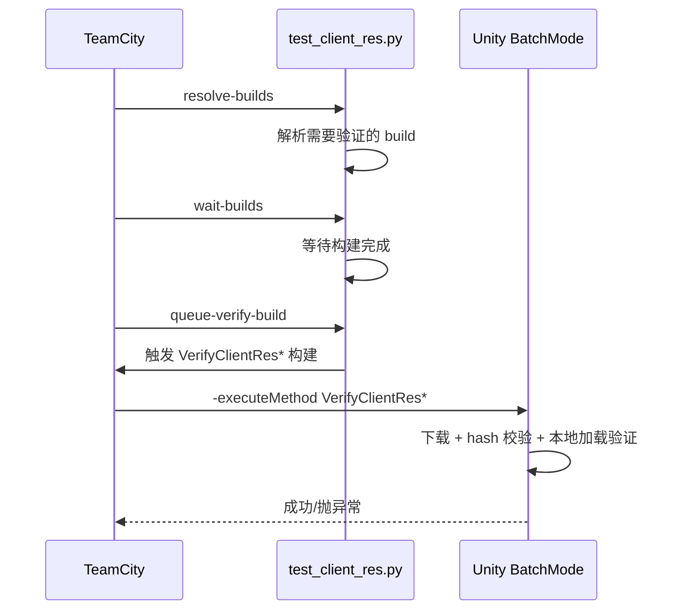

# BatchMode 与 CI 测试

## 三类 BatchMode 验证

| 类型 | 入口 | 目的 |
|------|------|------|
| 构建管线纯逻辑验证 | `BDFramework.EditorTest.DevOps.PublishPipeLineCITest.RunBatchVerification` | 验证 CI 参数解析、平台映射 |
| 文件服务器协议验证 | `BDFramework.EditorTest.AssetsManager.AssetsVersionControllerDevOpsBatchVerification.RunBatchVerification` | 验证下载/校验/版本比对 |
| 制品端到端验证 | `PublishPipeLineCI.VerifyClientRes{Android,IOS,Windows}` | 从文件服务器真实下载并校验 |

## 命令行模板

```bash
"$UNITY_PATH" -batchmode -quit \
  -projectPath "<repo>" \
  -executeMethod <类.方法> \
  -logFile <日志路径> \
  [额外参数]
```

!!! danger "`-quit` 与 `-force-open`"
    | 参数 | 说明 |
    |------|------|
    | `-quit` | **必须**。本机 Unity 2021.3.58f1 在 batchmode 主循环会因 License 签名校验崩溃（`CheckLicenseActivated()` → `Licensing::Module::ActivatedWithErrorReason()` segfault）。`-quit` 让 Unity 在执行完 `-executeMethod` 后、进入主循环前退出。 |
    | `-force-open` | **禁用**。本机执行会 Bus Error。 |
    | `-nographics` | 可选。是否使用都不影响上述崩溃（崩溃在主循环，不在图形）。 |

### 纯逻辑验证入口

```bash
"$UNITY_PATH" -batchmode -quit \
  -projectPath "/Users/naipaopao/Documents/GitHub/BDFramework.Core" \
  -executeMethod BDFramework.EditorTest.DevOps.PublishPipeLineCITest.RunBatchVerification \
  -logFile /tmp/PublishPipeLineCITest.log

"$UNITY_PATH" -batchmode -quit \
  -projectPath "/Users/naipaopao/Documents/GitHub/BDFramework.Core" \
  -executeMethod BDFramework.EditorTest.AssetsManager.AssetsVersionControllerDevOpsBatchVerification.RunBatchVerification \
  -logFile /tmp/AssetsVersionControllerDevOpsBatchVerification.log
```

### CI 资源验证入口

```bash
<Unity> -batchmode -quit \
  -projectPath <dir> \
  -executeMethod BDFramework.Editor.DevOps.PublishPipeLineCI.VerifyClientResAndroid \
  -buildTarget Android \
  -fileServerUrl http://<host>:<port>/files \
  -expectedCodeVersion <code> \
  -expectedAssetbundleVersion <ab> \
  -expectedTableVersion <table> \
  -logFile <log>
```

!!! warning "`-fileServerUrl` 必须包含 `/files`"
    Python 侧 base_url 不含 `/files`，传给 Unity 时会追加。

## BatchMode 下的框架初始化

!!! note "`GameConfigStartupPureLogic` 让无 MonoBehaviour 启动成为可能"
    ```csharp
    GameConfigLoder.LoadFrameworkConfig()
      → if (!GameConfigStartupPureLogic.ShouldLoadFrameworkConfigManager(GameConfigManager.Inst != null))
            return;      // 直接返回，不查场景、不读文件
      → GameConfigManager.Inst.Start()
    ```

    配置文本来源优先级：运行时 launcher → 场景 launcher → Editor 默认文件 → `None`。

### CI 入口的自动初始化

```csharp
static PublishPipeLineCI()
{
    if (Application.isBatchMode) BDFrameworkEditorEnvironment.InitEditorEnvironment();
}
```

`InitEditorEnvironment()` 会依次初始化 `BDEditorApplication`、`ScriptLoder`、`BResources`（Editor 后端）、`ManagerInstHelper`、`GameConfigLoder` 等。

## BatchMode 下的已知限制

| 限制 | 说明 |
|------|------|
| `TestContext.WriteLine` 抛 NRE | NUnit 的 `TestContext` 依赖 BatchMode 不提供的运行器基础设施。**改用 `UnityEngine.Debug.Log`** |
| AB 异步加载不推进 | 需要 `IEnumeratorTool` 组件（PlayMode 才有） |
| `BDLauncherBridge.Launch()` 需要 `BDLauncher.Inst` | 纯逻辑路径请用 `TalosE2EBatchBridge.PrepareEditorOnlyRuntime` 的初始化链 |
| Editor 下 `streamingAssetsPath` 被重写 | 指向 `DevOps/PublishAssets` |
| License 崩溃 | 必须 `-quit` |

## Python 侧测试

```bash
python -m pytest Packages/com.popo.bdframework/Editor.DevOps~/BuildTools/tests/ -q

# 包含远端制品测试（需要真实文件服务器）
python -m pytest Packages/com.popo.bdframework/Editor.DevOps~/BuildTools/tests/ \
    --run-remote-artifact-tests
```

| 测试文件 | 覆盖 |
|---------|------|
| `conftest.py` | `--run-remote-artifact-tests` 开关 + `remote_artifact` marker |
| `test_buildclientpackage_helpers.py` | 打包产物生成 / ZIP 条目 |
| `test_buildclientpackage_batchmode.py` | 命名路径、project dir 校验、Unity 可执行解析 |
| `test_buildclientpackage_main_flow.py` | 主流程（fake flow） |
| `test_buildtools_config.py` | external integration config 读取 |
| `test_artifact_uploader.py` | 本地上传 HTTP server（成功/错误/恢复） |
| `test_artifact_uploader_remote.py` | 远端 smoke（需 marker） |
| `test_client_resource_artifacts.py` | 输出根清理、Code/AB/Table staging、manifest 校验 |
| `test_client_resource_flow.py` | 三端 wrapper 委派、flow 步骤、dry-run |
| `test_client_resource_verify.py` | 验证 wrapper |
| `test_client_resource_version_manifest.py` | `version.info` 解析/校验 |
| `test_test_client_res.py` | TeamCity build 复用/等待逻辑 |

## 资源验证流程



Unity 侧 `VerifyFileServerAssetsForBatchModeWithDevOps` 内部：

1. `Task.Run(...).GetAwaiter().GetResult()` 后台下载
2. 回主线程做 `ValidateFileServerRepresentativeLocalLoads`
3. `ValidateFileServerPackageBuildInfo` 终检
4. 失败统一 `throw new Exception("[CI][VerifyClientRes] 文件服务器 BatchMode 验证失败! ...")`

日志前缀 `[CI][VerifyClientRes]`，含中文 `测试目的=` / `实现手段=`。

## 平台隔离

!!! warning "只有 Assetbundle 强制平台隔离 checkout"
    | 任务 | 隔离 |
    |------|------|
    | Assetbundle | ✓ `ClientRes/{platform}`（`git worktree add --force --detach`） |
    | Code | ✗ `ciProjectIsolation=skipped` |
    | Table | ✗ |
    | Verify | ✗ |

原因：AB 打包依赖平台相关的 `Library/` 与 SBP 缓存，跨平台复用会污染。

**iOS BatchMode SBP 首败重试**：重导纹理 + 清 `Temp/ContentBuildData`；**仅当工程不是平台隔离目录时**才额外 `BuildCache.PurgeCache(false)`。

## 相关页面

- [测试体系总览](overview.md)
- [Runtime 单元测试](runtime-tests.md)
- [DevOps 与 CI](../pipeline/devops-ci.md)
- [E2E（Talos）](e2e.md)
