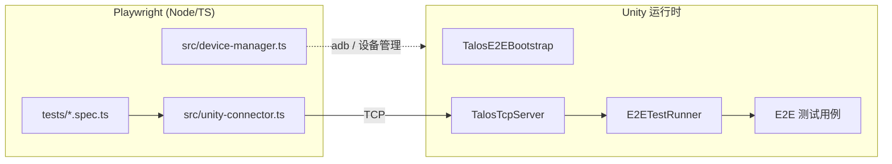

# E2E（Talos）

`Packages/com.talosai.e2e/` 提供跨进程 E2E 测试编排：**Playwright 侧驱动 → TCP 传输 → Unity 侧执行测试**。

!!! note "不属于框架本体"
    Talos E2E 是独立一方包，服务的是"框架自身质量验证"，不是给业务方用的运行时能力。

## 架构



## Unity 侧（`Runtime/`）

### TestRunner

| 文件 | 职责 |
|------|------|
| `E2ETestRunner.cs` | 测试执行器 |
| `E2ETestAttribute.cs` | 测试标记 |
| `TalosE2EBootstrap.cs` | 引导入口（`LaunchE2EStatic()` 支持无 MonoBehaviour 启动） |
| `E2EAutoInit.cs` | 自动发现与初始化 |
| `E2ESceneAutoStarter.cs` | 场景自动启动 |
| `RuntimeLaunchArguments.cs` | 运行时参数解析 |
| `DebugBuildMarker.cs` | Debug 构建标记 |

### Transport

| 文件 | 职责 |
|------|------|
| `TalosTcpServer.cs` / `TalosTcpClient.cs` | TCP 通信 |
| `Protocol.cs` | 协议定义 |
| `TalosPortPolicy.cs` | 端口策略 |

### Editor

| 文件 | 职责 |
|------|------|
| `E2EEditorTools.cs` | `LaunchE2EBatchMode()` 等编辑器侧入口 |
| `EditorCommandDispatcher.cs` | 编辑器命令分发 |

`Runtime/link.xml` 用于保证 IL2CPP 下 E2E 相关类型不被剪裁。

## Playwright 侧（`Playwright~/`）

`~` 后缀让 Unity 忽略该目录（纯 Node/TS 工程）。

### 测试套件

| 文件 | 覆盖 |
|------|------|
| `testBaseFlow-e2e.spec.ts` | 基础流程 |
| `testBaseFlow-EditorPlayer-e2e.spec.ts` | Editor Player 模式下的基础流程 |
| `testFrameworkCore-e2e.spec.ts` | 框架核心 |
| `testFrameworkBusiness-e2e.spec.ts` | 框架业务 |
| `testModuleIntegration-e2e.spec.ts` | 模块集成 |

### fixtures

| 文件 | 职责 |
|------|------|
| `fixtures.ts` | 基础 fixture |
| `fixtures-unityplayer.ts` | Unity Player fixture（端口分配、进程管理、截图） |

### `src/`

| 文件 | 职责 |
|------|------|
| `unity-connector.ts` | 与 Unity 建立连接、发命令、收结果 |
| `device-manager.ts` | 设备管理（PC / Android） |
| `unity-editor-ops.ts` | 编辑器操作 |
| `index.ts` | 导出入口 |

### `tools/` —— 运行脚本与配置

| 文件 | 作用 |
|------|------|
| `test-pc.sh` | PC 平台 E2E |
| `test-editorplayer.sh` | Editor Player E2E |
| `test-android.sh` | Android 真机/模拟器 E2E |
| `test-batchmode.sh` | BatchMode E2E |
| `connect_androidVirtualDevice.sh` | 连接 Android 虚拟设备 |
| `node-tools.sh` | Node 工具链准备 |
| `talos_e2e_config.py` / `.toml` | 配置读取 |
| `teamcity_e2e_runner.py` | TeamCity 集成 |
| `debug_build_helper.py` | Debug 构建辅助 |

### pytest 覆盖（`tools/tests/`）

| 文件 | 覆盖 |
|------|------|
| `test_talos_e2e_config.py` | 配置解析 |
| `test_teamcity_e2e_runner.py` | TeamCity runner |
| `test_pc_tool.py` / `test_android_tool.py` / `test_batchmode_tool.py` / `test_editorplayer_tool.py` | 各平台脚本 |
| `test_node_tools.py` | Node 工具链 |
| `test_il2cpp_preserve.py` | IL2CPP 保留验证 |
| `test_host_launch_suite_source.py` / `test_host_baseflow_suite_source.py` / `test_host_dependency_boundary.py` | 套件源码契约 |
| `test_framework_business_source.py` / `test_window_preconfig_source.py` | 业务源码契约 |
| `test_playwright_fixture_ports_source.py` / `test_playwright_step_screenshot_source.py` | fixture 契约 |

```bash
python -m pytest Packages/com.talosai.e2e/Playwright~/tools/tests/ -q
```

## 配置

`DevOps/CI/talos_e2e_config.toml`：

```toml
[talos.e2e]
client_version = "0.1"
build_debug = true
build_mode = "Debug"
timeout = 5400
unity_host = "127.0.0.1"
unity_port = 10002
```

## TeamCity 集成

| BuildType | 作用 |
|-----------|------|
| `TalosAI/TalosAI.E2E` | E2E 主任务 |

菜单入口（Editor）：

| 菜单 | 作用 |
|------|------|
| `Talos/E2E Test/创建 DEBUG 标记` | 创建 `DebugBuildMarker` |
| `Talos/E2E Test/移除 DEBUG 标记` | 移除标记 |
| `Talos/E2E Test/检查 DEBUG 状态` | 检查当前状态 |

!!! note "Debug 标记的作用"
    E2E 需要在 Debug 构建中运行。`DebugBuildMarker` 是一个可被运行时读取的标记，用于**快速判断当前包是否是 Debug 构建**，避免误在 Release 包上跑 E2E。

## BatchMode 启动

```csharp
// Editor 侧入口
TalosE2EBatchBridge.LaunchTalosE2EBatchMode();   // 打开 BDFrame.unity → E2EEditorTools.LaunchE2EBatchMode()
TalosE2EBatchBridge.LaunchTalosE2EEditorOnly();
TalosE2EBatchBridge.RunTalosE2EAndExport();
```

命令行参数：`-talosForceE2E`。

**Editor-only 路径不依赖 `BDLauncher` MonoBehaviour**：

```text
GameConfigLoder.LoadFrameworkConfig()
ClientAssetsUtils.GetMultiAssetsLoadPath(...)
CheckBaseClientAssets(...)
BResources.Init(config.ArtRoot, first, second)
SqliteLoder.Init(config.SQLRoot, first, second)
```

`TalosE2EBatchBridge.AssignEditorOnlyLauncherInstance` 会**反射回写** `BDLauncher.Inst` 的私有 setter，让运行时逻辑认为 launcher 已就绪。

## 无 MonoBehaviour 启动能力

`TalosE2EBootstrap.LaunchE2EStatic()` 支持在没有 `MonoBehaviour` 的情况下启动 E2E（TCP 模式）。

`IEnumeratorTool` **只在需要协程时才必需**（AB 异步加载等）；纯逻辑 E2E 可以不挂。

## 相关页面

- [测试体系总览](overview.md)
- [BatchMode 与 CI 测试](batchmode-tests.md)
- [启动链路](../architecture/bootstrap.md) —— 无 MonoBehaviour 路径
- [DevOps 与 CI](../pipeline/devops-ci.md)
