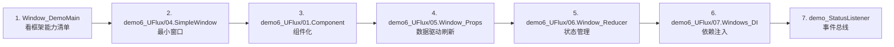

# 教程与 Demo

| 页面 | 内容 |
|------|------|
| [Demo 解读](demos.md) | `Assets/Code/Game@hotfix/` 下全部示例的逐目录说明 |
| [视频与外部资源](videos.md) | 知乎专栏、B 站视频等外部资料 |

## Demo 入口

工程内有两个 Demo 入口窗口：

| 窗口 | 类 | 内容 |
|------|-----|------|
| `Win_Main` | `Window_DemoMain` | 框架总览：单元测试、ScreenView、SQLite 查询、资源加载 |
| `Win_UFlux` | `Window_FluxDemoMain` | UFlux 全功能演示（组件 / 绑定 / Props / Reducer / DI） |

启动方式：运行 `Assets/Scenes/BDFrame.unity`，首屏 `ScreenView_Main` 会加载 `Win_Main`。

## 推荐学习路径

## 相关页面

- [UI（UFlux）](../ui/index.md)
- [窗口 Window](../ui/window.md)
- [状态管理 Reducer/Store](../ui/state-management.md)
- [事件总线 EventBus](../api/event-bus.md)
