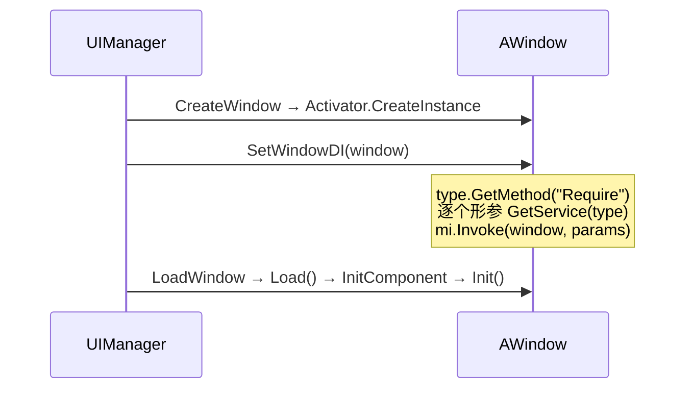

# 依赖注入

UFlux 提供一套**约定式**的轻量 DI：窗口实现一个名为 `Require` 的方法，框架在窗口创建后自动注入所需服务。

!!! info "没有 `[Dependency]` 特性"
    注入靠**方法名约定**（`Require`），不是特性。框架用 `type.GetMethod("Require")` 反射查找。

## 注入时机



**注入发生在构造之后、`Load()` 之前。** 因此 `Require` 里注入的服务在 `Init()` 中可以直接使用。

## 定义 `Require`

```csharp
[UI((int)WinEnum.Player, "Windows/Window_Player")]
public class Window_Player : AWindow
{
    private IPlayerModel _model;
    private IItemModel   _itemModel;

    // 方法名必须是 Require；形参即需要注入的服务
    public void Require(IPlayerModel model, IItemModel itemModel)
    {
        _model = model;
        _itemModel = itemModel;
    }

    public override void Init()
    {
        base.Init();
        _model.Load();          // 已注入，可直接用
    }
}
```

框架实现（`UIManager.SetWindowDI`）：

```csharp
public void SetWindowDI(IWindow window)
{
    var mi = window.GetType().GetMethod("Require");
    if (mi == null) return;

    var @params = mi.GetParameters();
    if (@params.Length == 0) return;

    object[] paramsObjs = new object[@params.Length];
    for (int j = 0; j < @params.Length; j++)
        paramsObjs[j] = this.GetService(@params[j].ParameterType);

    mi.Invoke(window, paramsObjs);
}
```

!!! warning "`Require` 必须是 `public`"
    `GetMethod("Require")` 使用默认绑定标志（`Public | Instance | Static`），**私有方法找不到**。

!!! warning "形参为 0 个时不会被调用"
    `if (@params.Length > 0)` 判断在前。写一个无参的 `Require()` 不会被执行。

## 注册服务

```csharp
public void AddSingleton<T>() where T : class;                  // 反射 new T()
public void AddSingleton(object inst);                          // 用现有实例
public void AddTransient<T>(T obj) where T : class;             // ★ 只用 obj 取类型
public T GetService<T>(T t) where T : class;
public object GetService(Type type);
```

| 方法 | 每次 `GetService` 返回 | 要求 |
|------|---------------------|------|
| `AddSingleton<T>()` | 同一实例 | `T` 有无参构造 |
| `AddSingleton(object)` | 同一实例 | — |
| `AddTransient<T>(T obj)` | **新实例** | `T` 有无参构造 |

!!! danger "`AddTransient<T>(T obj)` 会丢弃传入的实例"
    ```csharp
    public void AddTransient<T>(T obj) where T : class
    {
        var type = obj.GetType();
        // 只把 type 存进 transientList —— obj 本身被丢弃
        this.transientList.Add(type);
    }
    ```
    每次 `GetService` 都 `Activator.CreateInstance(type)`。**想注入一个有状态的实例请用 `AddSingleton(inst)`。**

### 注册位置

推荐在 `UIManager.Init()` 之后、加载任何窗口之前统一注册：

```csharp
// 业务启动代码
UIManager.Inst.AddSingleton<PlayerModel>();
UIManager.Inst.AddSingleton(new ConfigService("..."));
UIManager.Inst.AddTransient<ItemModel>(null);      // 注意：null 会 NRE，需传实例
```

!!! warning "重复注册会报错"
    `AddSingleton` / `AddTransient` 对同类型第二次调用会 `BDebug.LogError("已存在同类型的Singleton")`，但**不会覆盖**，后续 `GetService` 仍返回第一个。

## 解析顺序

```text
GetService(type)
 ① singletonList.FindLast(o => o.GetType() == type)      ← 单例优先
 ② transientList.FindLast(t => t == type) → Activator.CreateInstance
 ③ 都未命中 → 返回 null
```

**未注册的服务不会抛异常，而是注入 `null`**。`Require` 里务必做 null 检查。

```csharp
public void Require(IPlayerModel model)
{
    _model = model ?? throw new InvalidOperationException("IPlayerModel 未注册");
}
```

## 与 `ServiceContainer` 的关系

窗口自身也有一个独立的 DI 容器：

```csharp
public interface IWindow
{
    ServiceContainer ServiceContainer { get; }      // 每个窗口独立
}
```

`AWindow<TP>` 中的实现：

```csharp
public ServiceContainer ServiceContainer { get; } = new ServiceContainer();
```

两者的分工：

| 容器 | 作用域 | 注册方式 |
|------|--------|---------|
| `UIManager` 的 singleton/transient 列表 | **全局**（所有窗口共享） | `UIManager.Inst.AddSingleton/AddTransient` |
| `IWindow.ServiceContainer` | **单窗口** | 窗口内部自行注册 |
| `GameServiceStore` | **按模块名隔离** | `GameServiceStore.GetService("Module")` |

`GameServiceStore` 与 UFlux 的 DI **互不相通**——`SetWindowDI` 只查 `UIManager` 自己的两个列表。

```csharp
// GameServiceStore 是另一套（见「服务容器」页）
var container = GameServiceStore.GetService("Battle");
container.AddSingleton<BattleContext>();
```

## 完整示例

```csharp
// ── 服务接口与实现 ──
public interface IPlayerModel { void Load(); int Gold { get; } }

public class PlayerModel : IPlayerModel
{
    public int Gold { get; private set; }
    public void Load() => Gold = 100;
}

// ── 注册（业务启动时） ──
UIManager.Inst.AddSingleton<PlayerModel>();
// 注意：Require 里要的是 IPlayerModel，而注册的是 PlayerModel
// → 类型必须精确匹配，所以这里要按接口注册
UIManager.Inst.AddSingleton(new PlayerModel() as IPlayerModel);
```

!!! danger "注册类型必须与 `Require` 形参类型精确一致"
    `GetService` 用 `o.GetType() == type` 做**精确类型比较**，不做接口/基类匹配。`Require(IPlayerModel m)` 要求注册时 `AddSingleton` 的对象 `GetType()` 恰好是 `IPlayerModel`（接口实例）——这在实际中很难满足。

    **推荐做法**：`Require` 直接用具体类型。

    ```csharp
    // ✓ 推荐：用具体类型
    UIManager.Inst.AddSingleton<PlayerModel>();

    public void Require(PlayerModel model) { _model = model; }

    // ✗ 不推荐：接口类型需要注册时显式转型，容易出错
    public void Require(IPlayerModel model) { … }
    ```

## 常见故障

| 现象 | 根因 |
|------|------|
| `Require` 没被调用 | 方法不是 `public`；或形参为 0 个 |
| 注入的字段是 `null` | 服务未注册；或注册类型与形参类型不精确相等 |
| `Require` 里抛异常 | `GetService` 返回 `null` 后直接使用 |
| 每次拿到不同实例 | 用的是 `AddTransient`（设计如此） |
| `AddTransient` 传入的实例没生效 | 它只存类型，实例被丢弃 |
| 重复注册报错 | 同类型已注册过，第二次被忽略 |

## 相关页面

- [窗口 Window](window.md)
- [服务容器与日志](../api/utils.md) —— `ServiceContainer` / `GameServiceStore`
- [Demo 解读](../tutorials/demos.md) —— `demo6_UFlux/07.Windows_DI`
