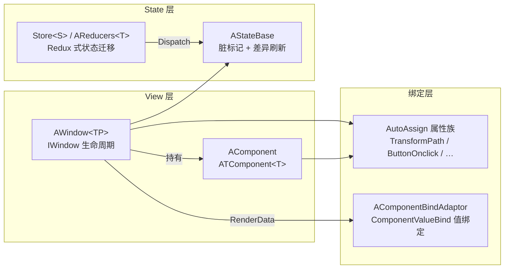

# UI（UFlux）

UFlux 是 BDFramework 的 UI 逻辑调度架构，采用类 **MVI（Model-View-Intent）** 分层：把"渲染数据"与"业务状态"分开，用 Reducer 处理状态迁移。

## 三层结构



## 阅读顺序

| 页面 | 内容 | 什么时候看 |
|------|------|-----------|
| [UFlux 架构总览](uflux-overview.md) | 为什么这样分层、与 Redux/MVC 的对照 | 第一次接触 UFlux |
| [窗口 Window](window.md) | `UIManager` 全 API、`IWindow` 生命周期、加载/显示/关闭 | 写第一个窗口 |
| [子窗口 SubWindow](sub-window.md) | 窗口拆分、父子消息转发 | 界面需要复用 |
| [消息 UIMessage](ui-message.md) | `UIMsgData` 与 `[UIMessageListener]` | 窗口间通信 |
| [组件 Component](component.md) | `ATComponent<T>` / `AComponent` | 写可复用 UI 单元 |
| [渲染数据 RenderData](render-data.md) | `ARenderDataBase`、`ComponentValueBind`、`PropsList` | 需要数据驱动刷新 |
| [自动赋值属性](auto-assign-attributes.md) | 5 个内置 Attribute + 自定义扩展 | 拿节点/绑事件 |
| [状态管理 Reducer/Store](state-management.md) | `AReducers<T>` / `Store<S>` / `Subscribe` | 复杂状态迁移 |
| [依赖注入](dependency-injection.md) | `Require(...)` + `AddSingleton`/`AddTransient` | 窗口需要外部服务 |

## 最小可用示例

```csharp
// 1) 定义窗口
[UI((int)WinEnum.Demo, "Windows/Window_Demo")]
public class Window_Demo : AWindow
{
    // 2) 节点自动赋值
    [TransformPath("btnClose")]
    private Button _btnClose;

    // 3) 事件自动绑定
    [ButtonOnclick("btnClose")]
    private void OnClickClose()
        => UIManager.Inst.CloseWindow(WinEnum.Demo);
}

// 4) 加载并显示
UIManager.Inst.LoadWindow(WinEnum.Demo);
UIManager.Inst.ShowWindow(WinEnum.Demo);
```

## 最容易踩的三个点

!!! danger "1. 窗口不是 `MonoBehaviour`"
    `AWindow<TP>` 继承 `ATComponent<TP>`，**不是 `MonoBehaviour`**。不要写 `Awake()` / `Update()`，生命周期用 `Init()` / `Open()` / `Close()`；拿节点用 `[TransformPath]` 而不是 `transform.Find()`。

!!! danger "2. `LoadWindow` 之后窗口常驻缓存"
    `windowMap` 里的窗口只有 `UnLoadWindow` / `UnLoadALLWindows` 才会真正 `Destroy()`。`ShowWindow` / `CloseWindow` 只切 `SetActive`。重复 `LoadWindow` 只打日志不重建。

!!! danger "3. `ShowWindow` 有前置条件"
    必须先 `IsLoad == true` 且 `IsOpen == false`，否则报错 `UI处于[unload,lock,open]状态之一`。

## 与业务 Demo 的对应关系

框架自带的完整 Demo 在 `Assets/Code/Game@hotfix/demo6_UFlux/`：

| Demo 目录 | 演示内容 |
|-----------|---------|
| `00.State` | State 定义与变更通知 |
| `01.Component` | 组件化拆分 |
| `02.CustomComponentBindAdator` | 自定义绑定适配器 |
| `04.SimpleWindow` | 最小窗口 |
| `05.Window_Props` | RenderData 驱动刷新 |
| `06.Window_Reducer` | Reducer / Store 状态迁移 |
| `07.Windows_DI` | `Require(...)` 依赖注入 |

→ 详见 [Demo 解读](../tutorials/demos.md)。
