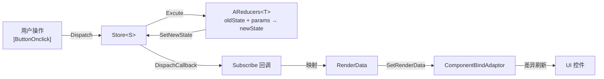

# UFlux 架构总览

## 要解决的问题

传统 Unity UI 的典型写法是 `MonoBehaviour` + `Update()` 轮询 + 直接改控件。规模上去之后会出现三类问题：

| 问题 | 表现 |
|------|------|
| 渲染与业务耦合 | 界面代码里混着协议解析、表格查询、网络请求 |
| 刷新时机不可控 | 靠 `Update()` 轮询字段变化，性能与可读性同时崩坏 |
| 复用困难 | 一个面板的逻辑与节点路径写死，无法拆出可复用单元 |

UFlux 用**分层**回答：业务状态归 State，渲染数据归 RenderData，界面只负责"把数据摆到节点上"。

## 三层职责

| 层 | 类型 | 职责 | 不该做什么 |
|----|------|------|-----------|
| **View** | `AWindow<TP>` / `ATComponent<T>` | 持有节点引用、响应输入、把 RenderData 摆到 UI 上 | 不查表、不发协议、不做状态迁移 |
| **RenderData（Props）** | `ARenderDataBase` | 描述"界面现在该长什么样" | 不持有业务逻辑 |
| **State** | `AStateBase` + `AReducers<T>` + `Store<S>` | 业务状态与状态迁移 | 不碰 UI 节点 |

## 数据流

关键在最后两步：**只有变化过的字段才会写入 UI**。差异分析由 `ComponentBindAdaptorManager.AnalysisRenderDataChanged` 完成。

## 与 Redux 的对照

| Redux | UFlux | 差异 |
|-------|-------|------|
| `Store` | `Store<S>` | 一致 |
| `Reducer` | `AReducers<T>` | 一致，且支持同步/异步/回调三种执行模式 |
| `dispatch(action)` | `Store.Dispatch(Enum actionEnum, object @params)` | 用 `Enum` 作 action 标识（比字符串安全） |
| `subscribe(listener)` | `Store.Subscribe(Action<S>)` / `Subscribe(Enum tag, …)` | 支持**按 action 标签订阅** |
| 中间件 | 无 | 未实现 |
| `combineReducers` | `StoreFactory.CreateStore<A,B,…>` + `StoreWrapper` | 支持 2~5 个 Store 组合 |
| 时间旅行调试 | `stateCacheQueue`（上限 20） | **`UnDo()` / `CancelUnDo()` 是空实现** |

!!! warning "Store 的历史回溯尚未实现"
    `Store<S>` 内部维护了 `stateCacheQueue`（默认缓存 20 条旧 State），但 `UnDo()` 与 `CancelUnDo()` 是**空方法体**。缓存只是预留。

## 与 MVC 的对照

| MVC | UFlux |
|-----|-------|
| Model | `AStateBase` 派生类（业务状态） |
| View | `AWindow<TP>` / `ATComponent<T>` |
| Controller | `AReducers<T>`（只做 `oldState + params → newState`，无状态） |
| — | **额外多一层 RenderData**：把 Model 映射成"界面可渲染的数据"，由 `AComponentBindAdaptor` 消费 |

多出的这一层是 UFlux 的核心取舍：它让"界面该长什么样"成为一个**可单独测试的纯数据**，代价是每个界面需要写一个 RenderData 类。

## 什么时候不需要 RenderData

不是所有窗口都需要完整三层。按复杂度选择：

| 场景 | 推荐做法 |
|------|---------|
| 只有几个按钮、无动态数据 | `AWindow` + `[TransformPath]` + `[ButtonOnclick]`，**不用** RenderData |
| 有动态文本/图片需要刷新 | `AWindow<TP>` + `ComponentValueBind` |
| 有列表增删改 | `AWindow<TP>` + `PropsList<T>` |
| 有跨窗口共享状态 | `Store<S>` + `AReducers<T>` |

!!! tip "不要迷信解耦"
    框架作者在原始文档里明确表达过：**界面合理拆分比盲目套用 MVC 更重要**。一个 20 行的弹窗硬拆成 Window + State + Reducer + RenderData 四个文件，可维护性反而下降。

## 关键类型速查

| 类型 | 命名空间 | 作用 |
|------|---------|------|
| `UIManager` | `BDFramework.UFlux` | 窗口总入口（`ManagerBase<UIManager, UIAttribute>`） |
| `UILayer` | `BDFramework.UFlux` | `Bottom` / `Center` / `Top` |
| `IWindow` / `AWindow` / `AWindow<TP>` | `BDFramework.UFlux` | 窗口 |
| `IComponent` / `ATComponent<T>` / `AComponent` | `BDFramework.UFlux` | 组件 |
| `ARenderDataBase` | `BDFramework.UFlux` | 渲染数据基类 |
| `AStateBase` / `StateBase` | `BDFramework.UFlux` | 状态基类 |
| `AReducers<T>` | `BDFramework.UFlux.Reducer` | Reducer 基类 |
| `Store<S>` / `IStore` / `StoreFactory` / `StoreWrapper` | `BDFramework.UFlux.Contains` | Redux 式 Store |
| `UFluxAction` | `BDFramework.UFlux.Reducer` | Action 载体 |
| `PropsList<T>` | `BDFramework.UFlux.Collections` | 差异列表 |
| `AComponentBindAdaptor` | `BDFramework.UFlux` | 值绑定适配器基类 |
| `ComponentBindAdaptorManager` | `BDFramework.UFlux` | 适配器注册与差异刷新 |

!!! note "`Store<S>` 的命名空间是 `BDFramework.UFlux.Contains`"
    不是 `BDFramework.UFlux`。`StoreFactory`、`IStore`、`StoreWrapper`、`SubscribeAttribute` 也都在这个命名空间里。写代码时容易漏 `using`。

## 相关页面

- [窗口 Window](window.md) —— 从创建到销毁的完整生命周期
- [状态管理 Reducer/Store](state-management.md) —— 详细 API
- [渲染数据 RenderData](render-data.md) —— 值绑定与差异刷新
- [Demo 解读](../tutorials/demos.md) —— 可运行示例
